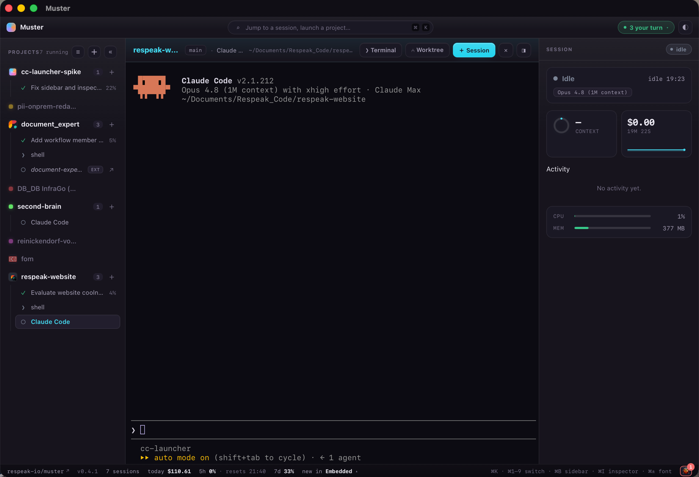

# Muster



A cross-platform desktop app to **launch and manage many [Claude Code](https://claude.com/claude-code) sessions at once** — each in its own embedded terminal, with live status, cost, and context telemetry streamed back to the app.

> **Status: early spike.** Muster grew out of a Phase-0 spike (see [`SPIKE.md`](./SPIKE.md)) proving the two risky pieces — embedding a real terminal and instrumenting Claude Code per-launch. It runs on macOS today and is under active development. Expect rough edges.

## What it does

- **Multi-session sidebar** — launch Claude in any of your projects and switch between running sessions. Each session is a real PTY, not a wrapper.
- **Embedded terminals** — full `claude` TUI rendered with [xterm.js](https://xtermjs.org/); optionally hand a session off to [Ghostty](https://ghostty.org/) instead.
- **Live telemetry** — a per-session status pill plus chips for model, context %, cost, and 5h/7d rate-limit usage, driven by Claude Code's hooks + statusLine (no global config mutation, no transcript-file parsing).
- **Git worktree launches** — spin up a session on a fresh worktree/branch of a repo.
- **Command palette** (`⌘K`), per-project accent colours and icons, and a persisted daily usage rollup.

## How it works

On each launch, Muster generates a throwaway `--settings` file whose `statusLine` command and `hooks` POST lifecycle events to a tiny localhost HTTP server the app runs. Because it also passes `--session-id`, every event maps back to the right pane before any output appears. See [`SPIKE.md`](./SPIKE.md) for the full architecture, the verified event lifecycle, and design notes.

## Stack

- **[Tauri v2](https://tauri.app/)** — Rust backend, system WebView frontend
- **[portable-pty](https://crates.io/crates/portable-pty)** — the PTY (ConPTY on Windows, forkpty on macOS)
- **[tiny_http](https://crates.io/crates/tiny_http)** — the localhost telemetry receiver
- **[xterm.js](https://xtermjs.org/)** — terminal rendering
- Vanilla TypeScript frontend (Vite)

## Install (macOS)

Download the latest `.dmg` from the [Releases page](https://github.com/respeak-io/muster/releases).

Muster is self-signed, **not notarized through Apple**, so macOS Gatekeeper quarantines the download and refuses to open it ("… is damaged and can't be opened"). Clear the quarantine flag from the terminal **before** opening the `.dmg`:

```sh
xattr -dr com.apple.quarantine ~/Downloads/Muster_*.dmg
```

Then open the `.dmg`, drag **Muster** into Applications, and launch it. If the app is still blocked on first launch, run the same command on the installed app:

```sh
xattr -dr com.apple.quarantine /Applications/Muster.app
```

Muster keeps itself up to date after that: it checks the latest GitHub release on launch and offers an in-app update (it never auto-installs — a restart would close your running sessions).

## Build from source

### Prerequisites

- [Node.js](https://nodejs.org/) 18+
- [Rust](https://www.rust-lang.org/tools/install) (stable) + the [Tauri system dependencies](https://tauri.app/start/prerequisites/) for your platform
- [Claude Code](https://claude.com/claude-code) installed and on your `PATH`

### Run it

```sh
npm install          # first time
npm run tauri dev
```

Then in the window: click **Launch Claude ▸**, pick a project, accept Claude's workspace-trust prompt in the terminal (first time in a directory), and ask it something. Watch the status pill and chips update live.

## Known limitations

- **macOS-first.** The generated hooks currently assume a macOS shell (`/usr/bin/curl`, `/bin/cat`); Windows needs a PowerShell/`curl.exe` variant.
- **Observe-only permissions.** `PermissionRequest` events are reported, not answered. A blocking permission hook that returns a decision to Claude is a later phase.

## License

[MIT](./LICENSE) © Respeak
